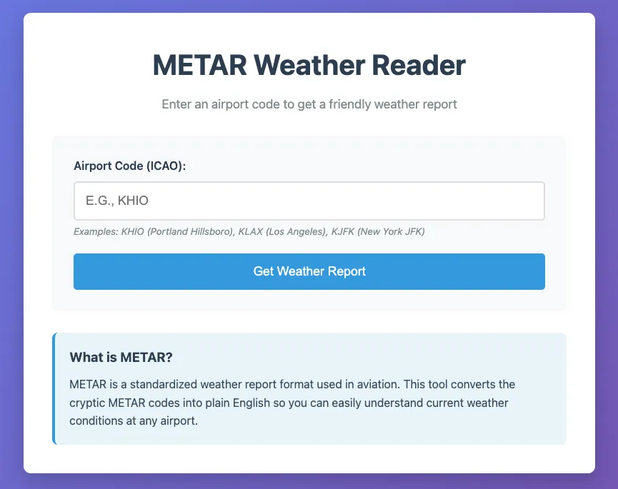
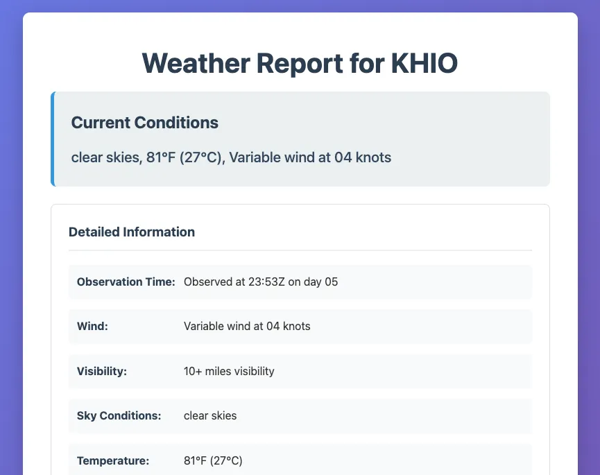

# METAR Reader 🌦️

A Flask web application that converts cryptic aviation weather reports (METAR) into human-readable format. Simply enter an airport code and get a friendly weather report that anyone can understand.


[](https://opensource.org/licenses/MIT)
[](https://www.python.org/downloads/)

## What is METAR?

METAR (Meteorological Aerodrome Report) is a standardized weather reporting format used in aviation. These reports contain essential weather information but are written in a cryptic code that's difficult for non-pilots to understand.

**Example:**
- **METAR Code:** `KHIO 051953Z 36008KT 10SM CLR 21/M01 A3012`
- **Human Translation:** "Clear skies, 70°F (21°C), wind from the north at 8 knots, 10+ miles visibility, pressure 30.12 inHg"

## Features

- 🌍 **Global Airport Support** - Works with any ICAO airport code worldwide
- 📱 **Responsive Design** - Works on desktop, tablet, and mobile
- 🌡️ **Temperature Conversion** - Shows both Celsius and Fahrenheit
- 🧭 **Wind Direction Translation** - Converts degrees to compass directions
- ☁️ **Cloud Coverage Decoding** - Explains cloud types and altitudes
- 🌦️ **Weather Phenomena** - Translates precipitation and visibility conditions
- ⚡ **Real-time Data** - Fetches current weather from Aviation Weather Center
- 🚫 **Error Handling** - Graceful handling of invalid airport codes and network issues

## Screenshots

### Home Page
Clean, simple interface for entering airport codes:


### Results Page
Comprehensive weather breakdown with both summary and detailed information:


## Installation

### Prerequisites

- Python 3.7 or higher
- pip (Python package installer)

### Quick Start

1. **Clone the repository:**
```bash
git clone https://github.com/JeremyMorgan/KodeKloud-METAR-Reader.git
cd KodeKloud-METAR-Reader
```

2. **Create a virtual environment:**
```bash
python3 -m venv venv
source venv/bin/activate  # On Windows: venv\Scripts\activate
```

3. **Install dependencies:**
```bash
pip install -r requirements.txt
```

4. **Run the application:**
```bash
python app.py
```

5. **Open your browser and visit:**
```
http://127.0.0.1:5000
```

## Usage

1. **Enter an airport code** - Use the 4-letter ICAO format (e.g., KHIO, KLAX, KJFK)
2. **Submit the form** - The app will fetch the current METAR data
3. **Read the results** - Get both a summary and detailed breakdown

### Popular Airport Codes

| Airport | Code | Location |
|---------|------|----------|
| Los Angeles International | KLAX | Los Angeles, CA |
| John F. Kennedy International | KJFK | New York, NY |
| Portland Hillsboro | KHIO | Hillsboro, OR |
| Chicago O'Hare | KORD | Chicago, IL |
| London Heathrow | EGLL | London, UK |
| Tokyo Haneda | RJTT | Tokyo, Japan |

## How It Works

### METAR Decoding Process

The application breaks down METAR reports into these components:

1. **Station Identifier** - 4-letter airport code
2. **Observation Time** - When the report was issued
3. **Wind Information** - Direction (degrees → compass) and speed
4. **Visibility** - Distance in statute miles
5. **Weather Phenomena** - Precipitation, fog, etc.
6. **Cloud Coverage** - Type and altitude of cloud layers
7. **Temperature/Dewpoint** - Current conditions
8. **Pressure** - Barometric pressure in inches of mercury

### Data Source

Weather data is fetched from the [Aviation Weather Center](https://aviationweather.gov/) API, which provides official METAR reports for airports worldwide.

## Project Structure

```
KodeKloud-METAR-Reader/
├── app.py                 # Main Flask application with METAR decoder
├── requirements.txt       # Python dependencies
├── templates/
│   ├── index.html        # Home page template
│   └── result.html       # Results display template
├── static/
│   └── style.css         # Application styling
└── README.md             # This file
```

## Development

### Adding New Features

The `METARDecoder` class is modular and easy to extend:

- **Wind decoding:** `get_wind_direction_text()`
- **Visibility parsing:** `decode_visibility()`
- **Cloud analysis:** `decode_clouds()`
- **Weather phenomena:** `decode_weather_phenomena()`

### Running Tests

```bash
# Test with various airport codes
python app.py
# Visit http://127.0.0.1:5000 and try codes like: KHIO, KLAX, KJFK, EGLL
```

### Code Quality

The codebase follows Python best practices:
- Comprehensive docstrings for all functions
- Type hints where appropriate
- Error handling for network requests
- Modular design for easy maintenance

## Deployment

### Production Deployment

For production use, replace the development server:

```bash
pip install gunicorn
gunicorn -w 4 -b 0.0.0.0:8000 app:app
```

### Docker Deployment

Create a `Dockerfile`:

```dockerfile
FROM python:3.9-slim
WORKDIR /app
COPY requirements.txt .
RUN pip install -r requirements.txt
COPY . .
EXPOSE 5000
CMD ["gunicorn", "-w", "4", "-b", "0.0.0.0:5000", "app:app"]
```

## Contributing

1. Fork the repository
2. Create a feature branch (`git checkout -b feature/amazing-feature`)
3. Make your changes
4. Add tests if applicable
5. Commit your changes (`git commit -m 'Add amazing feature'`)
6. Push to the branch (`git push origin feature/amazing-feature`)
7. Open a Pull Request

## License

This project is licensed under Creative Commons - see the [LICENSE](LICENSE) file for details. Use and modify freely.

## Acknowledgments

- **Aviation Weather Center** for providing free METAR data
- **Flask** community for the excellent web framework
- **METAR format specification** from ICAO standards

## Support

If you encounter any issues or have questions:

1. Check the [Issues](https://github.com/yourusername/KodeKloud-METAR-Reader/issues) page
2. Create a new issue if your problem isn't already reported
3. Include details about the airport code and error message

---

**Made with ❤️ for aviation enthusiasts and weather lovers**

*Convert cryptic weather codes into crystal-clear forecasts* ✈️